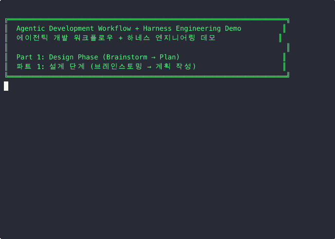
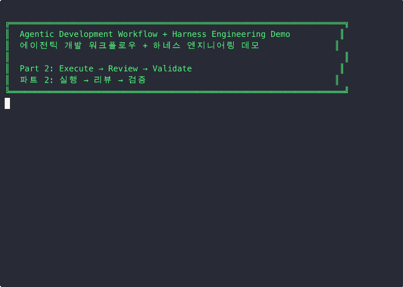
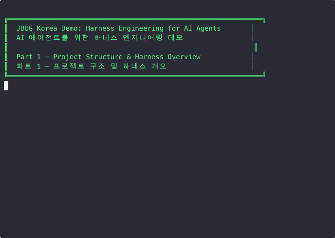
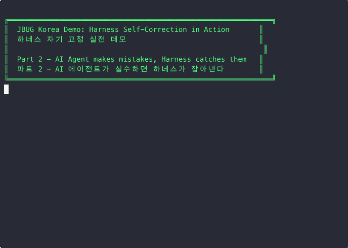
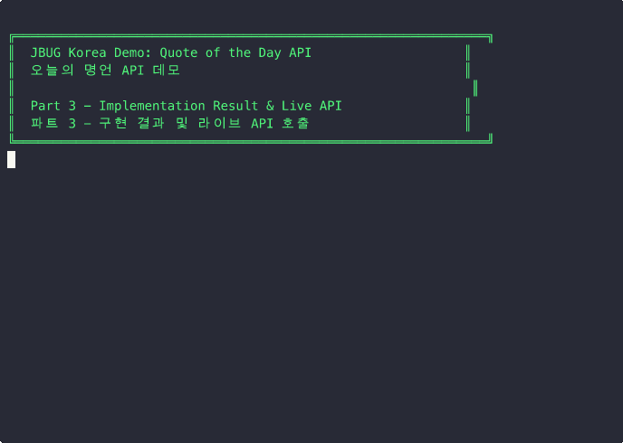

# Humans steer. Agents execute. - Agentic Development with Harness Engineering

A Quarkus project demonstrating **agentic development workflows** with **harness engineering** — enabling AI agents to develop autonomously with minimal human intervention.

Created for JBUG (JBoss User Group) Korea community to share AI agent-based software development methodologies.

**GitHub Repository:** <https://github.com/tedwon/agentic-dev-playbook-with-harness>

## Table of Contents

- [What Is This Project?](#what-is-this-project)
- [Agentic Development Workflow](#agentic-development-workflow)
- [Harness Engineering](#harness-engineering)
  - [Two Types of Controls](#two-types-of-controls)
  - [Self-Correction Loop](#self-correction-loop)
  - [7 Automated Checks](#7-automated-checks)
  - [Security Scanning (CI)](#security-scanning-ci)
- [Demos](#demos)
  - [Demo 1: Agentic Development Workflow](#demo-1-agentic-development-workflow--에이전틱-개발-워크플로우-데모)
  - [Demo 2: Harness Engineering Deep Dive](#demo-2-harness-engineering-deep-dive--하네스-엔지니어링-상세-데모)
  - [Quote of the Day API](#quote-of-the-day-api)
- [Tech Stack](#tech-stack)
- [Quick Start](#quick-start)
- [Project Structure](#project-structure)
- [AI Agent Plugins](#ai-agent-plugins)
- [Key Documents](#key-documents)
- [Links](#links)

## What Is This Project?

This repository serves three purposes:

1. **Agentic Development Playbook** — A guide documenting a 4-phase workflow (Design → Execute → Review → Validate) for human-AI collaborative feature development
2. **Harness Engineering** — Automated verification loops that let AI agents self-correct without human intervention
3. **Hands-on Quarkus Application** — A Java 21 + Quarkus REST API project where the workflow can be applied in practice

## Agentic Development Workflow

The [Agentic Development Playbook](agentic-development-playbook_v0.2.md) defines a **Human-in-the-Loop** AI collaborative development process:

1. **Design** — Brainstorm requirements, make design decisions, and create a detailed implementation plan
2. **Execute** — Implement step-by-step, with harness-enforced quality gates
3. **Review** — Create PR/MR, run CI checks, and conduct code review
4. **Validate** — Security scanning, local testing, and end-to-end verification

With harness engineering, the Execute phase becomes largely autonomous — the agent writes code, the harness verifies quality, and the agent self-corrects until all checks pass.

## Harness Engineering

> **"Humans steer. Agents execute."** — [OpenAI, Harness Engineering](https://openai.com/index/harness-engineering/)
>
> **Agent = Model + Harness**

The "harness" is everything around the AI model that makes it productive: rules, verification hooks, feedback loops, and guardrails. Harness improvements alone have moved agents from rank 30 to top 5 on coding benchmarks — without changing the model.

### Two Types of Controls

| Type | What It Does | Files |
|------|-------------|-------|
| **Feedforward** (guides) | Prevent errors before they happen | [CLAUDE.md](CLAUDE.md), [AGENTS.md](AGENTS.md), [CHECKLIST.md](CHECKLIST.md) |
| **Feedback** (sensors) | Detect and correct errors after they happen | [.claude/hooks/](.claude/hooks/)*.sh, Maven checks |

### Self-Correction Loop

```text
Agent writes code → git commit → Pre-commit harness runs 7 checks
  → FAIL: exit 2 + error message → Agent auto-fixes → retry
  → PASS: exit 0 → commit succeeds (no human intervention)
```

### 7 Automated Checks

| ID | Check | What It Verifies |
|----|-------|-----------------|
| BUILD-01 | Compilation | `./mvnw compile -q` succeeds |
| BUILD-02 | Tests | `./mvnw test` all green |
| BUILD-03 | Formatting | `./mvnw spotless:check -q` passes |
| QUAL-01 | No System.out | Logger only, no System.out.println |
| QUAL-02 | No secrets | No hardcoded passwords or API keys |
| CONV-01 | Commit format | [Conventional Commits](https://www.conventionalcommits.org/) (`type(scope): subject`) |
| CONV-02 | Test coverage | Every `@Path` class has a `*Test.java` |

See [CHECKLIST.md](CHECKLIST.md) for full details.

### Security Scanning (CI)

In addition to the pre-commit checks above, CI runs three security checks automatically on every push:

| ID | Check | What It Does |
| ---- | ------- | -------------- |
| SEC-01 | SpotBugs | Static analysis for common bug patterns (`./mvnw spotbugs:check`) |
| SEC-02 | Dependency-Check | Scans dependencies for known CVEs (`./mvnw dependency-check:check`) |
| SEC-03 | SBOM Generation | Generates a CycloneDX Software Bill of Materials (`./mvnw cyclonedx:makeAggregateBom`) |

SEC-02 uses the [OWASP Dependency-Check](https://owasp.org/www-project-dependency-check/) plugin to match project dependencies against the NIST National Vulnerability Database (NVD). The build fails if any dependency has a CVE with CVSS score >= 7.0 (High/Critical).

To run dependency-check locally, see the [OWASP Dependency-Check Guide](docs/owasp-dependency-check-guide.md) for setup instructions (NVD API key required).

```bash
# Run locally (requires NVD API key configured in ~/.m2/settings.xml)
./mvnw dependency-check:check

# Static analysis
./mvnw spotbugs:check
```

### SBOM (Software Bill of Materials)

This project generates a [CycloneDX](https://cyclonedx.org/) SBOM listing all 130+ dependencies with versions, licenses, and package URLs.

**Generate locally:**

```bash
./mvnw cyclonedx:makeAggregateBom
```

Output files:
- `target/bom.json` — CycloneDX JSON format
- `target/bom.xml` — CycloneDX XML format

**CI generation:** The GitHub Actions workflow ([ci.yml](.github/workflows/ci.yml)) runs SBOM generation automatically on every push. The generated files are uploaded as a downloadable artifact named `sbom-cyclonedx` (retained for 90 days).

## Demos

This project includes two sets of recorded demos. Each GIF plays inline below; click **"Watch on asciinema.org"** for the full interactive player (pause, speed control, copy text).

### Demo 1: Agentic Development Workflow / 에이전틱 개발 워크플로우 데모

Demonstrates the **full 4-phase agentic development playbook** (Design → Execute → Review → Validate) with harness engineering integrated into the execution phase.

<details>
<summary><b>1-1. Design Phase: Brainstorm → Spec → Plan / 설계 단계: 브레인스토밍 → 명세 → 계획</b></summary>

Walks through the playbook's 4-phase workflow, 6 design principles, the brainstorming Q&A process, spec generation, plan writing, and the design-to-execution handoff concept.



> **[Watch on asciinema.org](https://asciinema.org/a/MN4lI3Hy2TzPd8qA)** for full interactive playback

**Artifacts produced:**
- [Spec](docs/superpowers/specs/2026-04-18-DEMO-001-quote-api.md) — Requirements, design decisions, acceptance criteria
- [Plan](docs/superpowers/plans/2026-04-18-DEMO-001-quote-api.md) — 5 sequenced tasks with verification gates

</details>

<details>
<summary><b>1-2. Execute → Review → Validate / 실행 → 리뷰 → 검증</b></summary>

Shows Phase 2-4: executing the plan step-by-step, harness self-correction when the agent makes mistakes, code review with reflection pattern, and live API validation with Quarkus dev mode.



> **[Watch on asciinema.org](https://asciinema.org/a/Ykwey7zhwiz382GF)** for full interactive playback

</details>

**Related files:** [Agentic Development Playbook](agentic-development-playbook_v0.2.md) · [Spec](docs/superpowers/specs/2026-04-18-DEMO-001-quote-api.md) · [Plan](docs/superpowers/plans/2026-04-18-DEMO-001-quote-api.md)

---

### Demo 2: Harness Engineering Deep Dive / 하네스 엔지니어링 상세 데모

Focuses on the **harness self-correction mechanism** — how automated checks catch AI agent mistakes and guide fixes without human intervention.

<details>
<summary><b>2-1. Project Structure & Harness Overview / 프로젝트 구조 및 하네스 개요</b></summary>

Shows the project layout, [CLAUDE.md](CLAUDE.md) rules (feedforward control), the 7 pre-commit checks (feedback control), and the self-correction loop diagram.



> **[Watch on asciinema.org](https://asciinema.org/a/ZtKFtKKuI8KQEgHS)** for full interactive playback

</details>

<details>
<summary><b>2-2. Harness Self-Correction in Action / 하네스 자기 교정 실전</b></summary>

The AI agent writes code with 4 violations → harness blocks the commit → agent reads errors, fixes all violations → harness passes 7/7. No human intervention needed.

| Violation | Harness Check |
|-----------|---------------|
| `System.out.println` | QUAL-01 |
| Wrong indentation | BUILD-03 |
| Missing test file | CONV-02 |
| Bad commit message | CONV-01 |



> **[Watch on asciinema.org](https://asciinema.org/a/pR12Ev39Wf0uvbE8)** for full interactive playback

</details>

<details>
<summary><b>2-3. Feature Result & Live API / 기능 구현 결과 및 라이브 API</b></summary>

Shows the completed [Quote API](#quote-of-the-day-api) code, runs all 11 tests, starts Quarkus dev mode, and calls the endpoints live with `curl`.



> **[Watch on asciinema.org](https://asciinema.org/a/rUTNBM6VK7JvgfgY)** for full interactive playback

</details>

**Related files:** [harness-check.sh](demo/harness-check.sh) · [bad-QuoteResource.java](demo/bad-QuoteResource.java) · [pre-commit-harness.sh](.claude/hooks/pre-commit-harness.sh)

---

### Quote of the Day API

The demo feature implemented through the agentic workflow:

| Endpoint | Description |
|----------|-------------|
| `GET /api/quotes` | List all quotes (filter with `?category=programming`) |
| `GET /api/quotes/random` | Get a random quote |
| `GET /api/quotes/{id}` | Get a quote by ID (404 if not found) |

**Source:** [Quote.java](src/main/java/dev/tedwon/Quote.java) · [QuoteService.java](src/main/java/dev/tedwon/QuoteService.java) · [QuoteResource.java](src/main/java/dev/tedwon/QuoteResource.java)
**Tests:** [QuoteResourceTest.java](src/test/java/dev/tedwon/QuoteResourceTest.java) · [QuoteServiceTest.java](src/test/java/dev/tedwon/QuoteServiceTest.java) · [QuoteResourceIT.java](src/test/java/dev/tedwon/QuoteResourceIT.java)

---

## Tech Stack

- **[Java](https://openjdk.org/projects/jdk/21/)** 21 (records, sealed classes, pattern matching)
- **[Quarkus](https://quarkus.io/)** 3.34.x
- **[Maven](https://maven.apache.org/)** (mvnw wrapper included)
- **REST/JSON** ([Jakarta REST](https://jakarta.ee/specifications/restful-ws/))
- **[SmallRye Health](https://smallrye.io/smallrye-health/)** (health checks)
- **[Spotless](https://github.com/diffplug/spotless)** ([Google Java Format](https://github.com/google/google-java-format), AOSP style)

## Quick Start

```bash
# Dev mode with live reload
./mvnw quarkus:dev

# Run tests
./mvnw test

# Check code formatting
./mvnw spotless:check

# Auto-fix formatting
./mvnw spotless:apply

# Package
./mvnw package
```

In dev mode, the Dev UI is available at <http://localhost:8080/q/dev/>.

## Project Structure

```text
.
├── CLAUDE.md                              # Harness rules + self-correction protocol
├── AGENTS.md                              # AI agent guidelines + harness engineering
├── CHECKLIST.md                           # 7 verification rules (enforced by hooks)
├── agentic-development-playbook_v0.2.md   # Agentic development playbook
├── agentic-development-playbook_v0.2-ko.md # Agentic development playbook (Korean)
├── .claude/
│   ├── settings.json                      # Hook configuration + permissions
│   ├── hooks/
│   │   ├── pre-commit-harness.sh          # Pre-commit verification (7 checks)
│   │   ├── protect-files.sh               # Block edits to harness files
│   │   └── post-edit-verify.sh            # Quick compile check after edits
│   └── skills/
│       └── agentic-playbook/              # Agentic workflow skill
├── .cursor/
│   ├── settings.json                      # Plugin configuration (mirrors .claude)
│   ├── rules/
│   │   ├── harness-engineering.mdc        # Harness rules (auto-loaded by Cursor)
│   │   └── code-conventions.mdc           # Code conventions for Java files
│   └── skills/
│       └── agentic-playbook/              # Agentic workflow skill (Cursor)
├── demo/
│   ├── harness-check.sh                   # Standalone harness checker (CLI)
│   ├── bad-QuoteResource.java             # Deliberately bad code for demo
│   ├── 01-overview.sh                     # Demo 1-1 script
│   ├── 02-self-correction.sh              # Demo 1-2 script
│   ├── 03-feature-result.sh               # Demo 1-3 script
│   ├── recordings/*.cast, *.gif           # Harness demo recordings
│   └── agentic-workflow/
│       ├── 01-design-phase.sh             # Demo 2-1 script
│       ├── 02-execute-and-validate.sh     # Demo 2-2 script
│       └── recordings/*.cast, *.gif       # Agentic workflow recordings
├── docs/
│   ├── harness-engineering-how-it-works.md # How the harness works (comprehensive)
│   ├── harness-engineering-how-it-works-ko.md # How the harness works (Korean)
│   ├── harness-engineering-guide.md       # Harness engineering guide (Korean)
│   ├── maven-git-hook-auto-install.md     # Maven git hook auto-install guide
│   ├── ai-agent-references.md             # AI agent reference materials
│   ├── ADR/                               # Architecture Decision Records
│   ├── superpowers/
│   │   ├── specs/                         # Brainstorming output (specs)
│   │   └── plans/                         # Implementation plans
│   └── *-ko.md                            # Korean translations (5 files)
├── hooks/
│   ├── pre-commit                         # Standard git pre-commit hook (6 checks)
│   └── commit-msg                         # Standard git commit-msg hook (CONV-01)
├── scripts/
│   └── install-git-hooks.sh               # Symlinks hooks/ into .git/hooks/
├── pom.xml                                # Maven config + Spotless plugin
├── docs/
│   └── project-setup-history.md           # Project setup history
├── .github/
│   └── workflows/ci.yml                   # CI harness (mirrors pre-commit checks)
└── src/
    ├── main/java/dev/tedwon/
    │   ├── GreetingResource.java          # /hello endpoint
    │   ├── MyLivenessCheck.java           # Health check
    │   ├── Quote.java                     # Quote record DTO
    │   ├── QuoteService.java              # CDI service
    │   └── QuoteResource.java             # Quote REST endpoints
    ├── main/resources/
    │   └── application.properties         # App configuration
    ├── main/docker/
    │   ├── Dockerfile.jvm                 # JVM-based container image
    │   ├── Dockerfile.legacy-jar          # Legacy JAR container image
    │   ├── Dockerfile.native              # Native binary container image
    │   └── Dockerfile.native-micro        # Native micro container image
    └── test/java/dev/tedwon/
        ├── GreetingResourceTest.java      # Greeting test
        ├── GreetingResourceIT.java        # Greeting integration test
        ├── QuoteResourceTest.java         # Quote API test (5 tests)
        ├── QuoteServiceTest.java          # Service unit test (5 tests)
        └── QuoteResourceIT.java           # Quote integration test
```

## AI Agent Plugins

Both [Claude Code](https://code.claude.com/docs) ([`.claude/settings.json`](.claude/settings.json)) and [Cursor](https://www.cursor.com/) ([`.cursor/settings.json`](.cursor/settings.json)) share the same plugin configuration:

| Plugin | Source | Purpose |
| -------- | -------- | --------- |
| [**superpowers**](https://claude.com/plugins/superpowers) | `claude-plugins-official` | Structured workflows for brainstorming, planning, execution, TDD, debugging, code review, and git worktree management |
| [**code-simplifier**](https://github.com/anthropics/claude-plugins-official/tree/main/plugins/code-simplifier) | `claude-plugins-official` | Reviews recently changed code for reuse, quality, and efficiency — then fixes issues found. Invoked via `/simplify` |
| [**context7**](https://github.com/anthropics/claude-plugins-official/tree/main/external_plugins/context7) | `claude-plugins-official` | Fetches up-to-date library and framework documentation (e.g., Quarkus, Jakarta REST) so the agent uses current APIs instead of potentially stale training data |

These plugins extend the AI agent's capabilities beyond the base model, complementing the harness engineering controls (CLAUDE.md rules + pre-commit hooks) with structured development workflows and real-time documentation access.

> **Note:** This project has been tested with **Claude Code** only. Cursor support (`.cursor/rules/*.mdc` + standard git hooks in `hooks/`) is provided but has **not been tested**. If you use Cursor, run `./scripts/install-git-hooks.sh` to enable harness checks and please report any issues.

## Key Documents

- [How the Harness Works](docs/harness-engineering-how-it-works.md) — Comprehensive guide: architecture, internals, and usage examples
- [Harness Engineering Guide](docs/harness-engineering-guide.md) — How the harness enables autonomous AI development (Korean)
- [Verification Checklist](CHECKLIST.md) — 7 rules enforced automatically before every commit
- [Agentic Development Playbook](agentic-development-playbook_v0.2.md) — AI collaborative workflow guide
- [OWASP Dependency-Check Guide](docs/owasp-dependency-check-guide.md) — Setup, NVD API key configuration, and local usage
- [AI Agent References](docs/ai-agent-references.md) — Agent development framework references from Anthropic, McKinsey, and others
- [ADR Template](docs/ADR/ADR-template.md) — Architecture Decision Record template

## Links

### Harness Engineering

- [OpenAI — Harness Engineering](https://openai.com/index/harness-engineering/)
- [OpenAI — Unlocking the Codex Harness](https://openai.com/index/unlocking-the-codex-harness/)
- [Anthropic — Effective Harnesses for Long-Running Agents](https://www.anthropic.com/engineering/effective-harnesses-for-long-running-agents)
- [Anthropic — Harness Design for Long-Running Apps](https://www.anthropic.com/engineering/harness-design-long-running-apps)
- [Awesome Harness Engineering](https://github.com/ai-boost/awesome-harness-engineering)

### Agentic Development

- [Anthropic — Building Effective Agents](https://www.anthropic.com/research/building-effective-agents)
- [Claude Code](https://code.claude.com/docs)
- [Quarkus](https://quarkus.io/)

### Korean Translations

- [하네스 엔지니어링 작동 원리](docs/harness-engineering-how-it-works-ko.md)
- [OpenAI — 하네스 엔지니어링](docs/openai-harness-engineering-ko.md)
- [Anthropic — 장기 실행 에이전트를 위한 효과적인 하네스](docs/effective-harnesses-for-long-running-agents-ko.md)
- [Anthropic — 장기 실행 앱을 위한 하네스 설계](docs/harness-design-long-running-apps-ko.md)
- [Anthropic — 효과적인 에이전트 구축](docs/building-effective-agents-ko.md)

---

## Disclaimer

This project was generated with the assistance of AI and guided, reviewed, and curated by **Ted Jongseok Won**.

For questions or feedback, please open an issue on [GitHub Issues](https://github.com/tedwon/agentic-dev-playbook-with-harness/issues).
